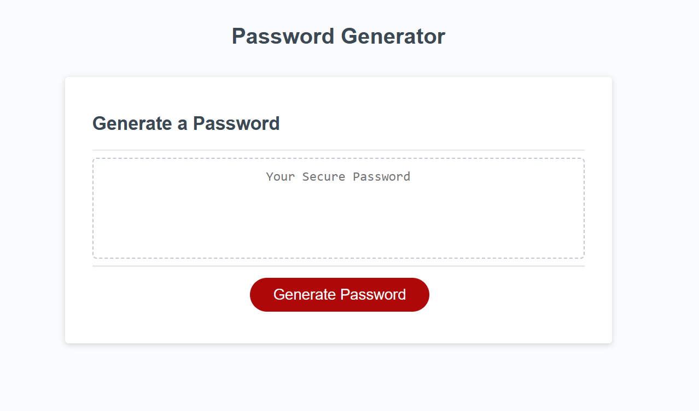

# Password Generator 
## Description 
The following is a password generator which will randomly generate a secure password for the user depending on how many characters the user wants the password to be as well as the types of characters the user desires. I decided to build this to learn more about JavaScript as well as its uses in developing interactive sites and applications.

## How to use
Simply press the generate password button at the bottom and you will be prompted for the various conditions you'd like to have for your password. After that is done, your new password will be provided to you.

## Credits
Special thanks to [friendly-parakeet](https://github.com/coding-boot-camp/friendly-parakeet) for providing the code to help me get started.

## License
MIT License